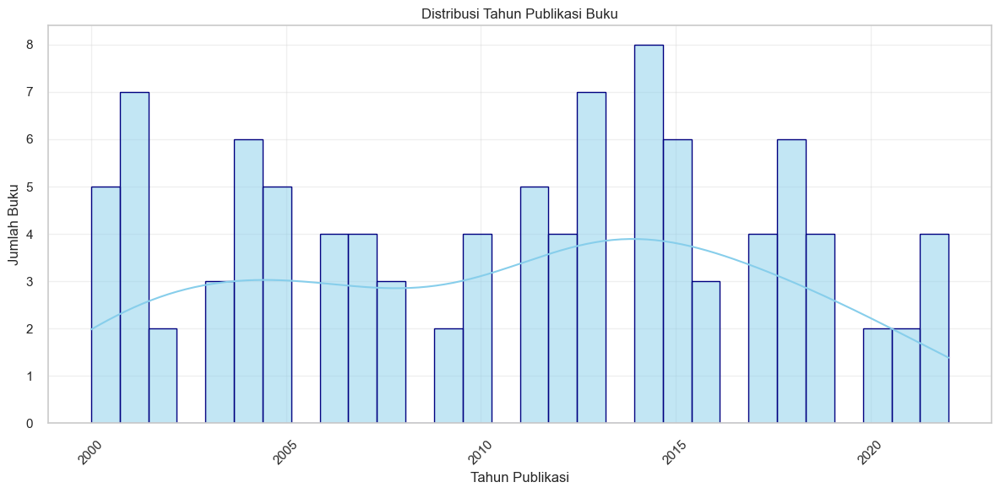
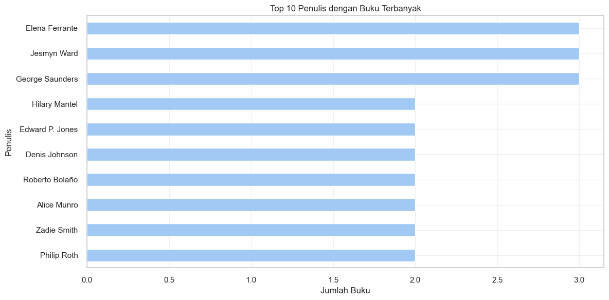
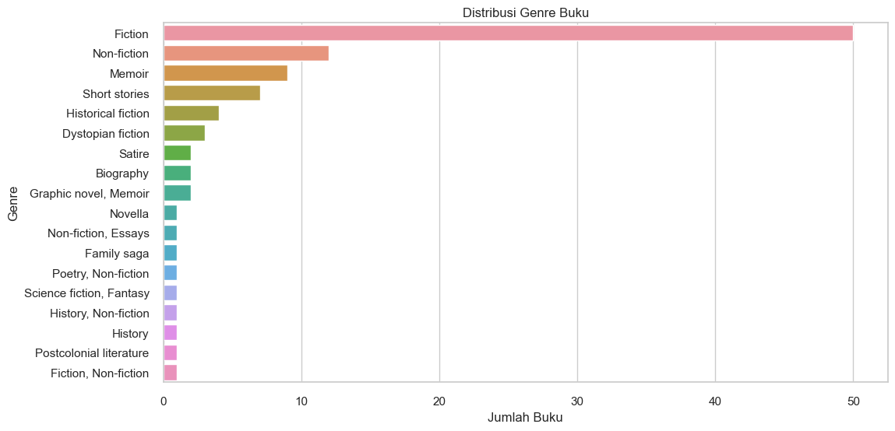

# 📊 UAS Web Scraping Python — Semester 4

## 📌 Deskripsi Proyek

Proyek ini merupakan **Ujian Akhir Semester (UAS)** mata kuliah **Python**, yang berfokus pada penerapan teknik **Web Scraping** untuk mengambil data dari website publik dan mengolahnya menjadi dataset terstruktur.

Pada proyek ini, saya melakukan pengambilan data daftar **100 Best Books versi The New York Times**, kemudian membersihkan, menyimpan, dan memvisualisasikan data menggunakan Python.

Proyek ini menunjukkan kemampuan saya dalam:

* Pemrograman Python
* Pengambilan data dari web (web scraping)
* Pengolahan dan analisis data
* Visualisasi data sederhana

---

## 🎯 Tujuan Proyek

* Memahami struktur HTML dari sebuah website
* Mengambil data menggunakan teknik web scraping
* Mengolah data mentah menjadi dataset terstruktur
* Menyimpan data dalam format CSV
* Menyajikan data dalam bentuk visualisasi agar mudah dipahami

---

## 🛠️ Tools & Teknologi

Proyek ini dikembangkan menggunakan:

* 🐍 **Python 3**
* 📓 **Jupyter Notebook**
* 🌐 **Requests** – untuk mengambil halaman web
* 🥣 **BeautifulSoup** – untuk parsing HTML
* 📊 **Pandas** – untuk pengolahan data
* 📈 **Matplotlib / Seaborn** – untuk visualisasi data
* 📁 **CSV** – format penyimpanan data

---

## 📂 Struktur Repository

```
4-PYTHON/
│
├── UASSCRAPPING.ipynb
├── TheNewYorkTimes100BestBooks.csv
└── README.md
```

---

## 🔄 Alur Proses Web Scraping

Berikut tahapan yang dilakukan dalam notebook:

1. **Import Library**

   * Mengimpor library Python yang dibutuhkan

2. **Request ke Website**

   * Mengambil halaman web target menggunakan HTTP request

3. **Parsing HTML**

   * Membaca dan mengekstrak data dari tag HTML tertentu

4. **Pengambilan Data**

   * Mengambil informasi seperti:

     * Judul buku
     * Penulis
     * Tahun / kategori (sesuai data yang tersedia)

5. **Pembersihan Data**

   * Menghilangkan data kosong atau tidak valid

6. **Penyimpanan Data**

   * Menyimpan hasil scraping ke file CSV

7. **Visualisasi Data**

   * Menampilkan data dalam bentuk grafik

---

## 📊 Dataset

Hasil scraping disimpan dalam file:

📁 **TheNewYorkTimes100BestBooks.csv**

Dataset ini berisi daftar **100 buku terbaik versi The New York Times** yang telah diolah dan siap digunakan untuk analisis lanjutan.

---

## 📈 Visualisasi Data

Beberapa visualisasi yang ditampilkan dalam notebook antara lain:

### 🔹 1. Jumlah Buku Berdasarkan Tahun

Visualisasi ini menunjukkan distribusi buku berdasarkan tahun rilis.



---

### 🔹 2. Penulis dengan Jumlah Buku Terbanyak

Grafik ini menampilkan Top 10 penulis yang paling sering muncul dalam daftar 100 buku terbaik.



---

### 🔹 3. Distribusi Genre Buku

Visualisasi ini membantu melihat genre apa saja yang paling sering muncul.



---

## 🚀 Cara Menjalankan Proyek

1. Clone repository:

```bash
git clone https://github.com/DalilaTazkia/4-PYTHON.git
```

2. Masuk ke folder project:

```bash
cd 4-PYTHON
```

3. Jalankan Jupyter Notebook:

```bash
jupyter notebook
```

4. Buka file `UASSCRAPPING.ipynb` dan jalankan cell secara berurutan

---

## 📌 Insight & Kesimpulan

* Web scraping memungkinkan pengambilan data publik secara otomatis
* Data mentah dari web perlu dibersihkan sebelum dianalisis
* Visualisasi membantu memahami pola dan distribusi data
* Python sangat efektif untuk pengolahan data berbasis web

---

## 👩‍💻 Author

**Dalila Tazkia**
Mahasiswa Semester 4
Project UAS Python — Web Scraping
